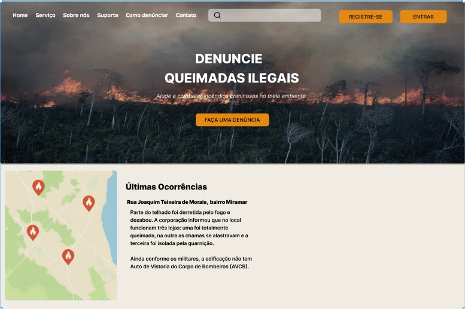
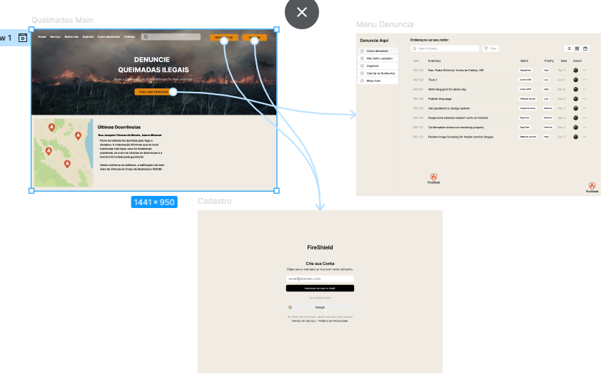
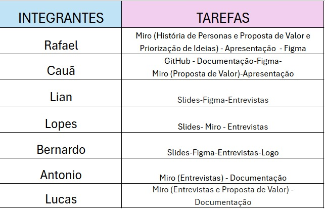
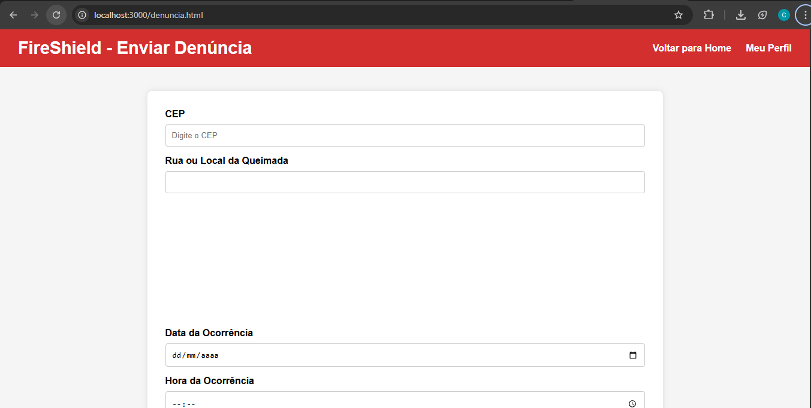
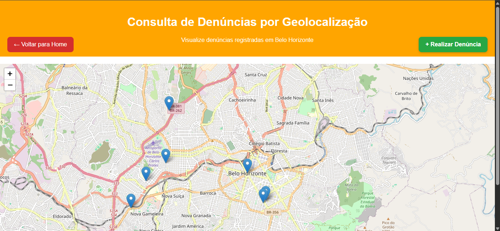
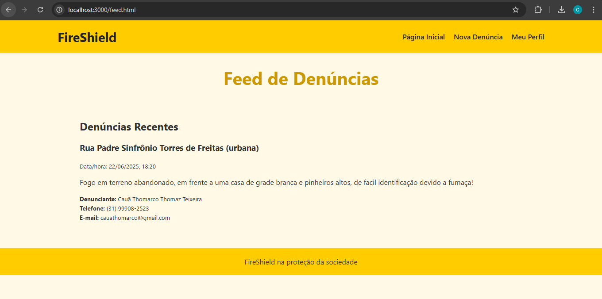
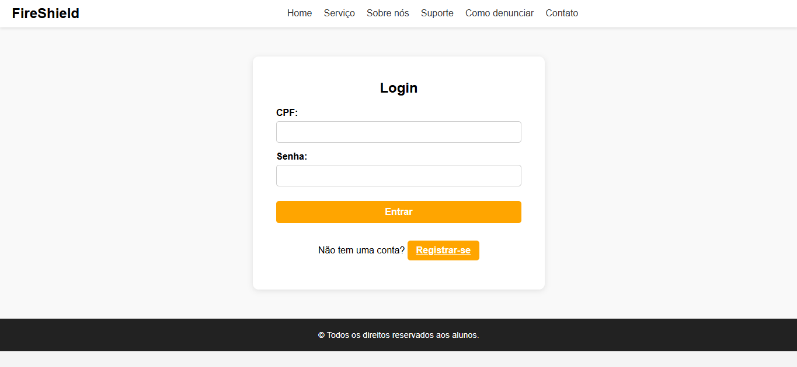
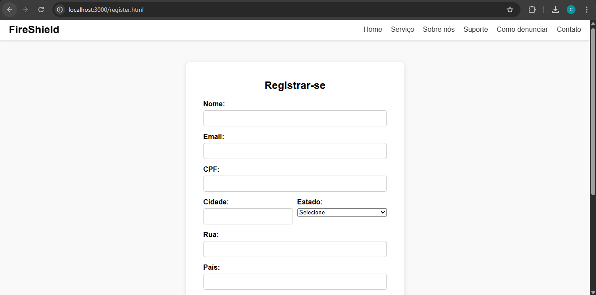

# Introdução

As queimadas causam danos ambientais e à saúde, agravados pela detecção tardia e falta de denúncias. Um software de denúncia facilitará o reporte rápido de focos de incêndio, conectando cidadãos às autoridades para uma resposta mais ágil e eficaz, reduzindo impactos e promovendo a conscientização.

* **Projeto:**
[FireShield]
* **Repositório GitHub:** 
[https://github.com/ICEI-PUC-Minas-PMGES-TI/pmg-es-2025-1-ti1-2401100-fireshield.git]
* **Membros da equipe:**

  * [Cauã Thomarco](https://github.com/CauaThomarco)
  * [Guilherme Mello](https://github.com/GuilhermeAMello)
  * [Lucas Domingos](https://github.com/LucasDomingos1)
  * [Lian Vasconcelos](https://github.com/Lianvq)

A documentação do projeto é estruturada da seguinte forma:

1. Introdução
2. Contexto
3. Product Discovery
4. Product Design
5. Metodologia
6. Solução
7. Referências Bibliográficas

✅ [Documentação de Design Thinking (MIRO)](files/processo-dt.pdf)

# Contexto

Detalhes sobre o espaço de problema, os objetivos do projeto, sua justificativa e público-alvo.

## Problema

**As queimadas representam uma grave ameaça ao meio ambiente e à saúde pública. Elas resultam na destruição da biodiversidade, degradação do solo, poluição atmosférica e agravam problemas respiratórios na população. Além disso, as queimadas contribuem para o aquecimento global ao liberar grandes quantidades de CO₂ na atmosfera. No entanto, a detecção tardia e a falta de denúncias dificultam a resposta rápida e eficaz, permitindo que o fogo se alastre e cause ainda mais danos.**

**A rápida detecção de queimadas pode ser um fator crucial para minimizar seus impactos ambientais e de saúde. No entanto, há desafios significativos que dificultam esse processo, como a ausência de um sistema eficiente de denúncia e a falta de conscientização da população. Além disso, a demora na resposta às queimadas pode agravar a destruição da biodiversidade e afetar diretamente as comunidades locais, tornando a prevenção e o combate mais complexos.**

**Outro aspecto relevante é o impacto da tecnologia na participação ativa da sociedade no combate às queimadas. Uma solução eficiente poderia incentivar o envolvimento da população e fortalecer a conexão entre cidadãos e autoridades responsáveis. Dessa forma, entender os fatores que influenciam a eficiência na denúncia e a resposta ao fogo é essencial para mitigar os danos causados por esses eventos.**

## Objetivos

**O objetivo principal do nosso software é aumentar a eficiência dos bombeiros na região de Minas Gerais, trazendo mais rapidez no processo, clareza nas informações e um procedimento mais fluído.**
**Para atingirmos esse objetivo principal, devemos pensar em alguns objetivos mais específicos, sendo eles: Entender as dores dos clientes, entender o processo realizado pelo CBMMG (Corpo de Bombeiros Militar de Minas Gerais), buscar uma forma de passar a informação de forma clara e dinâmica para acelerar a rapidez para resolução do chamado, informar e atualizar os clientes sobre status de denúncias de forma quase imediata, utilizar o serviço do Google Maps para obter informações para trazer dinamicidade para resolução de denúncias. (Dentro das Leis Gerais de Proteção de Dados (LGPD)).**

## Justificativa

**Compreender que a detecção tardia das queimadas e a falta de denúncias dificultam a resposta eficaz e agravam os impactos ambientais e sociais, apresentando uma solução baseada em um software de denúncia que facilita o reporte rápido de focos de incêndio, conectando cidadãos às autoridades de maneira ágil e precisa. Essa iniciativa é voltada para a população e órgãos responsáveis pelo combate ao fogo, fundamentando-se no uso da tecnologia como ferramenta essencial para a conscientização e redução dos danos causados pelas queimadas.**

## Público-Alvo

**O público-alvo que irá utilizar o Software serão pessoas adultas, preocupadas com a segurança e velocidade do processo dos bombeiros, preocupadas com o meio ambiente e e que querem acompanhar as denúncias em andamento e resolvidas pelo CBMMG.**

# Product Discovery

## Etapa de Entendimento

****
****
****
****

## Etapa de Definição

### Personas

****
****
****
****

# Product Design

Nesse momento, vamos transformar os insights e validações obtidos em soluções tangíveis e utilizáveis. Essa fase envolve a definição de uma proposta de valor, detalhando a prioridade de cada ideia e a consequente criação de wireframes, mockups e protótipos de alta fidelidade, que detalham a interface e a experiência do usuário.

## Histórias de Usuários

Com base na análise das personas foram identificadas as seguintes histórias de usuários:

| EU COMO...`PERSONA` | QUERO/PRECISO ...`FUNCIONALIDADE`        | PARA ...`MOTIVO/VALOR`               |
| --------------------- | ------------------------------------------ | -------------------------------------- |
| Analista de dados  | Acompanhar ocorrências de queimadas na minha região e me informar sobre impactos ambientais | Preciso monitorar padrões de queimadas e seus efeitos no meio ambiente            |
| Bombeiro        | Receber e denunciar ocorrências de queimadas     | Preciso agir rapidamente para conter incêndios e proteger áreas naturais |
| Professora de biologia       | Denunciar queimadas em terrenos baldios e áreas próximas     | Preciso ajudar a proteger minha comunidade e melhorar a qualidade do ar|
| Fazendeira          | Conseguir atendimento rápido do Corpo de Bombeiros para as denúncias rurais     | Proteger minha produção e evitar prejuízos causados pelo fogo |

## Proposta de Valor

**Na parte Inferior da Imagem**
****
****
****
****

## Requisitos

As tabelas que se seguem apresentam os requisitos funcionais e não funcionais que detalham o escopo do projeto.

### Requisitos Funcionais

| ID     | Descrição do Requisito                                                | Prioridade |
| ------ | --------------------------------------------------------------------- | ---------- |
| RF-001 | O sistema deve permitir o cadastro de usuários com nome, e-mail e senha. | ALTA       |
| RF-002 | O sistema deve permitir que os usuários realizem login e logout de forma segura. | ALTA       |
| RF-003 | O sistema deve permitir que os usuários publiquem conteúdo e interajam com postagens de outros usuários. | ALTA       |
| RF-004 | O sistema deve permitir que os usuários denunciem conteúdos impróprios. | ALTA       |
| RF-005 | O sistema deve permitir que os administradores editem, corrijam erros e excluam denúncias falsas. | MÉDIA      |
| RF-006 | O sistema deve permitir que os usuários consultem seu histórico de interações e atividades na plataforma. | MÉDIA      |
| RF-007 | O sistema deve enviar notificações para os usuários sobre atualizações e interações relevantes. | MÉDIA      |
| RF-008 | O sistema deve oferecer um sistema de busca para encontrar conteúdos e usuários. | MÉDIA      |

### Requisitos Não Funcionais

| ID      | Descrição do Requisito                                                             | Prioridade |
| ------- | -------------------------------------------------------------------------------- | ---------- |
| RNF-001 | O sistema deve estar disponível 24 horas por dia, 7 dias por semana.             | ALTA       |
| RNF-002 | O sistema deve apresentar um tempo de resposta inferior a 3 segundos em condições normais de uso. | ALTA       |
| RNF-003 | O sistema deve ser responsivo e adaptável a diferentes dispositivos, incluindo smartphones e desktops. | ALTA       |
| RNF-004 | O sistema deve garantir a segurança dos dados dos usuários por meio de criptografia. | ALTA       |
| RNF-005 | O sistema deve possuir mecanismos de recuperação de senha para usuários.         | MÉDIA      |
| RNF-006 | O sistema deve armazenar e recuperar dados de forma eficiente para garantir a integridade das informações. | MÉDIA      |
| RNF-007 | O sistema deve permitir escalabilidade para suportar um grande número de usuários simultâneos. | MÉDIA      |
| RNF-008 | O sistema deve realizar backups automáticos para evitar perda de dados em caso de falhas. | BAIXA      |

## Projeto de Interface

Artefatos relacionados com a interface e a interacão do usuário na proposta de solução.

### Wireframes

Estes são os protótipos de telas do sistema.

**Descrição do Protótipo**
  **A interface apresenta os seguintes elementos:**
    **Cabeçalho com fundo escuro translúcido, contendo:**
      **Um menu horizontal com as opções: Home, Serviço, Sobre nós, Suporte, Como denunciar e Contato.**
      **Uma barra de busca centralizada com ícone de lupa.**
      **Dois botões no canto direito: "REGISTRE-SE" e "ENTRAR", em destaque com fundo laranja.**
  **Banner principal:**
    **Imagem de fundo mostrando uma floresta em chamas, simbolizando o foco do sistema em queimadas ilegais.**
   **Texto centralizado em branco com os dizeres:**
      **"DENUNCIE QUEIMADAS ILEGAIS"**
      **Abaixo, em fonte menor: "Ajude a combater incêndios criminosos no meio ambiente"**
      **Um botão laranja com o texto "FAÇA UMA DENÚNCIA".**
    **Seção de Últimas Ocorrências (logo abaixo do banner):**
    **À esquerda, um mapa com marcadores indicando locais de ocorrência de queimadas.**
    **À direita, um bloco de texto com título "Últimas Ocorrências" e descrição de uma ocorrência:**
      **Destaque para o endereço: Rua Joaquim Teixeira de Morais, bairro Miramar.**
      **Descrição textual do incidente, mencionando danos estruturais e a ausência de laudo do Corpo de Bombeiros (AVCB).**

##### TELA XPTO 

Descrição para a tela XPTO



### User Flow

**  **

### Protótipo Interativo

** [Protótipo Interativo (Figma)]()https://www.figma.com/design/ye4YEljIlmBsrYQNqR1l2V/Untitled?node-id=1-2771&t=hairN469wtgXVMPW-1**

# Metodologia

Detalhes sobre a organização do grupo e o ferramental empregado.

## Ferramentas

Relação de ferramentas empregadas pelo grupo durante o projeto.

| Ambiente                    | Plataforma | Link de acesso                                     |
| --------------------------- | ---------- | -------------------------------------------------- |
| Ambiente de Reuniões | WhatsApp       | Link não disponivel, reuniões realizadas em chamada  |
| Processo de Design Thinking | Miro       | https://miro.com/app/board/uXjVIaSTdRc=/?share_link_id=26320249912Links  |
| Repositório de código     | GitHub     | https://github.com/ICEI-PUC-Minas-PMGES-TI/pmg-es-2025-1-ti1-2401100-fireshield.git     |
| Hospedagem do site          | Render     | https://fireshield-1.onrender.com |
| Protótipo Interativo       | Figma  | https://www.figma.com/design/ye4YEljIlmBsrYQNqR1l2V/Untitled?node-id=0-1&m=dev&t=LiZypibi0Y5oIMbq-1   |
|                             |            |                                                    |


## Gerenciamento do Projeto

Divisão de papéis no grupo e apresentação da estrutura da ferramenta de controle de tarefas (Kanban).



# Solução Implementada

Esta seção apresenta todos os detalhes da solução criada no projeto.

## Vídeo do Projeto

## Vídeo do Projeto
 Projeto em video da equipe

[](images/video.png)

O video excede 100mb, favor descompactar o arquivo

Caso o video fique sem som o video tambem esta disponibilizado na plataforma Youtube

**  **

## Funcionalidades

Esta seção apresenta as funcionalidades da solução.Info

##### Funcionalidade 1 - Envio de Denuncias

Permite o envio de denúncias sobre queimadas de forma anônima ou identificada, com inclusão de dados como local, data, hora, tipo da área, descrição e imagem/vídeo. 

* **Estrutura de dados:** [Denuncias](#ti_ed_denuncias)
* **Instruções de acesso:**
  * Acesse a página Nova Denúncia 
  * Preencha o formulário com os dados obrigatórios 
  * Ao digitar o CEP, o campo de rua será preenchido automaticamente 
  * A latitude e longitude são calculadas com base no endereço informado 
* **Tela da funcionalidade**:



##### Funcionalidade 2 - Visualização de Denuncias no Mapa

Exibe todas as denúncias com base em suas coordenadas geográficas em um mapa interativo. 

* **Estrutura de dados:** [Denuncias](#ti_ed_denuncias)
* **Tecnologia utilizada:** [Leaflet]
* **Instruções de acesso:**
  * Acesse a página de mapa (ex: mapa.html) 
  * As denúncias serão exibidas com marcadores no mapa 
* **Tela da funcionalidade:**



##### Funcionalidade 3 - Feed de Denuncias

Visualização das denúncias em formato de carrossel, exibindo dados como local, data, tipo de área, descrição e foto. 

* **Estrutura de dados:** [Denuncias](#ti_ed_denuncias)
* **Instruções de acesso:**
  * Acesse a página Feed de Denúncias 
  * O carrossel exibe automaticamente as denúncias em ordem mais recente 
* **Tela da funcionalidade:**



##### Funcionalidade 4 - Cadastro e Login de Usuarios

Usuários podem se registrar e realizar login para acompanhar e gerenciar suas denúncias.  

* **Estrutura de dados:** [Usuarios](#ti_ed_usuarios)
* **Instruções de acesso:**
  * Acesse as páginas register.html e login.html 
  * Após login, você será redirecionado ao perfil 
* **Tela da funcionalidade:**




## Estruturas de Dados

Descrição das estruturas de dados utilizadas na solução com exemplos no formato JSON.Info

##### Estrutura de Dados - Denuncias

Estrutura utilizada para estar salvando as denuncias realizadas pelos usuarios

```json
  {
     "denuncias": [
    {
      "local": "teste",
      "data": "2025-06-19",
      "hora": "11:11",
      "tipoArea": "urbana",
      "descricao": "11",
      "arquivo": "1",
      "nome": "",
      "telefone": "",
      "email": "",
      "userId": 2,
      "id": 1750543876416
    }
  ]
  }
  
```

##### Estrutura de Dados - Usuários 

Registro dos usuários do sistema utilizados para login e para o perfil do sistema

```json
{
  [
   {
      "id": "2",
      "nome": "Cauã Thomarco",
      "email": "cauathomarco@gmail.com",
      "cpf": "14406119639",
      "cidade": "Pedro Leopoldo",
      "estado": "MG",
      "pais": "Brasil",
      "identidade": "C:\\fakepath\\Captura de tela 2025-05-30 115235.png",
      "rua": "Rua Padre Sinfronio Torres de Freitas - 199",
      "senha": "1011"
    },
    {
      "id": "1",
      "nome": "Admin",
      "email": "admin@site.com",
      "cpf": "12345678910",
      "cidade": "Belo Horizonte",
      "estado": "MG",
      "pais": "Brasil",
      "senha": "admin123",
      "admin": true,
      "fotoPerfil": "assets/img/perfil-icon.png"
    },
  ]
}
```

## Módulos e APIs

Esta seção apresenta os módulos e APIs utilizados na solução

**Mapa**

* Leaflet - [https://leafletjs.com/](https://leafletjs.com/)
* Nominatim (OpenStreetMap Geocoding) - [https://nominatim.openstreetmap.org/](https://nominatim.openstreetmap.org/)

**Localização e Endereço**

* ViaCEP (Consulta de Endereço por CEP)** - [https://viacep.com.br/](https://viacep.com.br/)

**Images**:

* Unsplash - [https://leafletjs.com/](https://leafletjs.com/)

**Scripts:**

* LeafletJS - [https://leafletjs.com/](https://leafletjs.com/)
* jQuery - [http://www.jquery.com/](http://www.jquery.com/)
* Bootstrap 4 - [http://getbootstrap.com/](http://getbootstrap.com/) 

# Referências

As referências utilizadas no trabalho foram:

* CORPO DE BOMBEIROS MILITAR DO ESTADO DE SÃO PAULO. Cuidados em caso de incêndio residencial. São Paulo: CBMESP, 2023. Disponível em: https://www.corpodebombeiros.sp.gov.br/noticias/cuidados-incendio. Acesso em: 21 jun. 2025.
* MINAS GERAIS. Corpo de Bombeiros Militar. Código de Segurança Contra Incêndio e Pânico – COSCIP. Decreto nº 44.746, de 29 de fevereiro de 2008. Diário do Executivo, Belo Horizonte, MG, 1 mar. 2008. Disponível em: https://www.bombeiros.mg.gov.br/legislacao. Acesso em: 21 jun. 2025.
* TRIBUNAL DE CONTAS DO ESTADO DE MINAS GERAIS. Manual de fiscalização de obras públicas. Belo Horizonte: TCE-MG, 2023. Disponível em: https://www.tce.mg.gov.br/. Acesso em: 21 jun. 2025
* BRASIL. Corpo de Bombeiros Militar. Atuação, estrutura e serviços prestados. Brasília, DF: Ministério da Justiça e Segurança Pública, 2024.
* CORPO DE BOMBEIROS MILITAR DE MINAS GERAIS. Site oficial do Corpo de Bombeiros Militar de Minas Gerais. Belo Horizonte: CBMMG, [2025]. Disponível em: https://www.bombeiros.mg.gov.br/. Acesso em: 21 jun. 2025.
